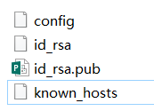
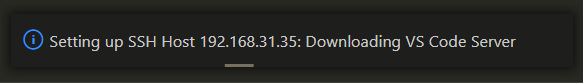
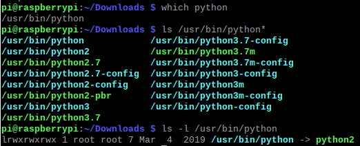
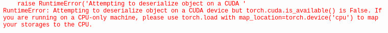

[TOC]
# Raspberry Pi 4B

**System info**

- Hardware: Raspberry Pi 4 Model B (4 GB RAM version)
- System: Raspbian Buster with desktop
- Architecture: armv7l
- Python 3.7.3

---

```shell
$ uname -a
$ lsb_release -a
```

> No LSB modules are available.
> Distributor ID:	Raspbian
> Description:	Raspbian GNU/Linux 10 (buster)
> Release:	10
> Codename:	buster


Ref. [Official documentation](https://www.raspberrypi.org/documentation/)


## SSH

### SSH to Remote

```shell
ssh username@ip -p port –i id_rsa
```

for RPI4

```shell
ssh pi@192.168.xx.xx
pwd: raspberry
```


### Local ssh key generation

```shell
ssh-keygen -t rsa -C "your_email"				add email address
ssh-keygen -f xxx 								-f set the output file name
```

generated files：

- `known_hosts`: connected remote servers
- `config`: short name, ip, port, username, ssh private key location, etc.
- `id_rsa` local private key
- `id_rsa.pub` local public key
- `authorized_keys`: others public keys
  


**config**

```shell
Host aliasxxx
	HostName xxx.xxx.xxx.xx
	User xxx
	IdentityFile ~/.ssh/id_rsa
```

```shell
ssh aliasxxx
```


### Copy Local Public Key to Remote Server

```shell
ssh-copy-id -i ~/.ssh/id_rsa.pub pi@192.168.x.x	
```

tips: 

- require to enter the passwd of the remote server
- require the right to modify the `authorized_keys` file (pi:pi 644) on the remote server


### Remote SSH via VSCode 

> using ssh via vscode

Install and configure remote ssh in VSCode：

- Install plug-in `Remote-SSH`

- In `Remote Explore` click `+` to add new remote host

- Enter `ssh pi@xxx.xxx.xxx.xx`x, select the location of the target `config` file

- Right click --> connect

- Select the OS of the remote server:`linux`,`windows`,`macOS` etc.，then vscode will download  and configure the `VS Code Server` on the remote

  

- `Open Folder` to open the target folder on remote


## VNC 

### VNC Server

Start the VNC Server on RPI

```shell
sudo raspi-config

-> interface -> start vnc server
```


### VNC Viewer 

- install VNC Viewer

- add new host (setting up ip address, username)

- double click the new host to connect

- require to enter the `username` and `passwd` of the remote host 

  tips：the VNC passwd may be reqiured depending on the VNC Server Configurations.
  


## Software Installation

apt-get:

```shell
sudo apt-get update
sudo apt-get upgrade
sudo apt autoremove

#search a library
sudo apt-cache search libxxxx  

# free space:
sudo apt-get clean
sudo apt-get autoremove
sudo apt-get purge wolfram-engine
sudo apt-get purge libreoffice*
```


vim:

```shell
sudo apt-get install vim
```

compile-related:

```shell
sudo apt-get install build-essential cmake git pkg-config
```

congfigure git:

```shell
git config --global user.name "your name"
git config --global user.email "your name"
```


QT-5:

```shell
sudo apt-get install qt5-default qtcreator
```

> qt-5.11.3


## Install OpenCV

### Python3 Version

**check python version**

```shell
$ which python
$ ls /usr/bin/python*
```




```shell
python3 xxx
```


#### Install 3rd-Party Libraries

```shell
sudo apt-get install build-essential cmake git pkg-config libjpeg8-dev libtiff5-dev libjasper-dev libpng12-dev libavcodec-dev libavformat-dev libswscale-dev libv4l-dev libgtk2.0-dev libatlas-base-dev gfortran libopenblas-dev libatlas3-base -y
```

install 3rd-party libraries for:

- compilation
- image processing
- video processing
- optimization
- computation

> Install additional libraries depending on the error info


#### Install opencv-python

```shell
pip3 install opencv-python
```

versions:

- python3.7, numpy1.16.2

- opencv-python-4.5.3.56


```shell
pip3 list
```


### C++ Version (install from source codes)

#### Downloads

```shell
cd ~/Downloads
wget https://codeload.github.com/opencv/opencv/zip/3.4.0
```
or：
```shell
cd ~/Downloads
wget https://github.com/opencv/opencv/archive/3.4.0.zip
```

or:

https://opencv.org/releases/ 

#### unzip

`3.4.0.zip` -> extract here -> `opencv-3.4.0`

or:

```shell
cd ~/Downloads
unzip 3.4.0.zip
```


#### Compile OpenCV

```shell
cd /home/pi/Downloads/opencv-3.4.0

mkdir build

cd build

cmake -D CMAKE_BUILD_TYPE=RELEASE -D CMAKE_INSTALL_PREFIX=/home/pi/local/opencv-3.4.0 -D BUILD_opencv_python2=OFF -D BUILD_opencv_python3=OFF -D WITH_LIBV4L=ON -D OPENCV_GENERATE_PKGCONFIG=ON ..

make -j4
make install
```

[:elephant: Click to see compile logs](./res/logs_rpi4_opencv.md)


tips:

- `/home/pi/local/opencv-3.4.0 `, NOT`/home/pi/local/opencv-3.4.0/`
- Some errors occurred due to the failures of downloading needed files; try to cmake agin to fix the errors.
- `opencv.pc` file is stored in`/home/pi/local/opencv-3.4.0/lib/pkgconfig/`


opencv.pc

> \#Package Information for pkg-config
>
> prefix=/home/pi/local/opencv-3.4.0/
> exec_prefix=${prefix}
> libdir=${exec_prefix}/lib
> includedir_old=${prefix}/include/opencv
> includedir_new=${prefix}/includeName: OpenCV
> Description: Open Source Computer Vision Library
> Version: 3.4.0
> Libs: -L${exec_prefix}/lib -lopencv_dnn -lopencv_ml -lopencv_objdetect -lopencv_shape -lopencv_stitching -lopencv_superres -lopencv_videostab -lopencv_calib3d -lopencv_features2d -lopencv_highgui -lopencv_videoio -lopencv_imgcodecs -lopencv_video -lopencv_photo -lopencv_imgproc -lopencv_flann -lopencv_core
> Libs.private: -ldl -lm -lpthread -lrt
> Cflags: -I${includedir_old} -I${includedir_new}


#### Configure OpenCV Libraries (*.so)

##### C++ demo: main.cpp

```shell
#include<opencv2/opencv.hpp>
#include<iostream>
 
using namespace std;
using namespace cv;
 
int main(){
   
    IplImage* img = cvCreateImage(cvSize(200,200), 8, 3);	
    Mat src = cvarrToMat(img);
    imshow("input image", src);
    waitKey(0);

    cvReleaseImage(&img);
    return 0;
}
```


##### For the Compilers to Find the Header Files and Library Files

tips：

- Different compilers have their own protocols, e.g., g++, make, cmake, qmake, etc., but the principle is to configure the paths of the header and library files.

- The following configurations are based on `pkg-config` and g++.

 

**pkgconfig configurations：**

  - add `pkgconfig/openv.pc` to the system's `pkgconfig` searching directories：

    ```shell
    $ vim /home/pi/.bashrc  
    
    at the end of this file, add the following config:  
    
    export PKG_CONFIG_PATH=$PKG_CONFIG_PATH:/home/pi/local/opencv-3.4.0/lib/pkgconfig 
    ```
  - Test pkg-config with OpenCV (Open a new terminal)：
    ```shell
    $  pkg-config --help
    $  pkg-config --list-all
    $  pkg-config --modversion  opencv
    3.4.0
    
    $  pkg-config --cflags opencv
    -I/home/pi/local/opencv-3.4.0/include/opencv -I/home/pi/local/opencv-3.4.0/include
    
    $  pkg-config --libs opencv
    -L/home/pi/local/opencv-3.4.0/lib -lopencv_dnn -lopencv_ml -lopencv_objdetect -lopencv_shape -lopencv_stitching -lopencv_superres -lopencv_videostab -lopencv_calib3d -lopencv_features2d -lopencv_highgui -lopencv_videoio -lopencv_imgcodecs -lopencv_video -lopencv_photo -lopencv_imgproc -lopencv_flann -lopencv_core
    ```


##### Compile the demo

```shell
g++ -o a.out main.cpp `pkg-config --cflags --libs opencv`
```


##### Runtime configurations

Add the OpenCV's `lib` path to the system's searching directories：

**Global**

```shell
$ sudo vim /etc/ld.so.conf.d/opencv.conf

/home/pi/local/opencv-3.4.0/lib

$ sudo ldconfig
```

or:

**Shell-based：**

```shell
vim /home/pi/.bashrc

at the end of this file, add the following:

export LD_LIBRARY_PATH=$LD_LIBRARY_PATH:/home/pi/local/opencv-3.4.0/lib
```


##### Execute the demo

```shell
./a.out
```


## Machine Learning Libraries（scipy,sklearn,pytorch,torchvision）

### Install scipy

```shell
pip3 install scipy   				
pip3 install scikit-build			
```

> matplotlib installed


### Install sklearn

```shell
pip3 install -U scikit-learn
```

> Successfully installed joblib-1.0.1 scikit-learn-0.24.2 threadpoolctl-2.2.0


### Install pytorch-1.3.0

- Download：torch-1.3.0a0+de394b6-cp37-cp37m-linux_armv7l.whl，search it via [Google](https://www.google.com.hk/search?q=torch-1.3.0a0%2Bde394b6-cp37-cp37m-linux_armv7l.whl&source=hp&ei=FwRcYfm4Fs2vrgSVz6PYBw&iflsig=ALs-wAMAAAAAYVwSJyr-8GuS-z0hQQhqVa-f76lRma1y&ved=0ahUKEwi5oLbr5LLzAhXNl4sKHZXnCHsQ4dUDCAs&oq=torch-1.3.0a0%2Bde394b6-cp37-cp37m-linux_armv7l.whl&gs_lcp=Cgdnd3Mtd2l6EAxQnAtYnAtgkRJoAXAAeACAAawCiAGsApIBAzMtMZgBAKABAqABAbABAA&sclient=gws-wiz) or [Baidu](https://www.baidu.com/s?wd=torch-1.3.0a0%2Bde394b6-cp37-cp37m-linux_armv7l.whl&rsv_spt=1&rsv_iqid=0xbdce126800102613&issp=1&f=8&rsv_bp=1&rsv_idx=2&ie=utf-8&tn=baiduhome_pg&rsv_dl=tb&rsv_sug3=2&rsv_n=2&rsv_sug2=0&rsv_btype=i&inputT=643&rsv_sug4=690)。
- Installation：`pip3 install torch-1.3.0a0+de394b6-cp37-cp37m-linux_armv7l.whl`


### Install torchvision-0.4.1

- Download: torchvision-0.4.1a0+a263704-cp37-cp37m-linux_armv7l.whl
- Installation：`pip3 install torchvision-0.4.1a0+a263704-cp37-cp37m-linux_armv7l.whl`


**Load the GPU pretrained model to a CPU:**

```shell
torch.load('xxx.pkl', map_location='cpu')
```

Otherwise the following error occures:




Refs.

[1] A PyTorch demo: https://zhuanlan.zhihu.com/p/57938855


## Install Other Toolkits

### Screenshot

```shell
scrot 		
scrot -s   	
scrot -d10 	
scrot -s -d10 
```

tip: the image is stored in the current folder


### Install libusb

```shell
sudo apt-get install libusb-dev
```

> pi@raspberrypi:/usr $ find -name "libusb*"
> ./lib/arm-linux-gnueabihf/libusbmuxd.so.4.1.0
> ./lib/arm-linux-gnueabihf/libusb.a
> ./lib/arm-linux-gnueabihf/libusb-0.1.so.4.4.4
> ./lib/arm-linux-gnueabihf/libusb-1.0.so.0
> ./lib/arm-linux-gnueabihf/libusb-0.1.so.4
> ./lib/arm-linux-gnueabihf/libusb-1.0.so.0.1.0
> ./lib/arm-linux-gnueabihf/libusb.so
> ./lib/arm-linux-gnueabihf/pkgconfig/libusb.pc
> ./lib/arm-linux-gnueabihf/libusbmuxd.so.4
> ./share/doc/libusb-1.0-0
> ./share/doc/libusbmuxd4
> ./share/doc/libusb-0.1-4
> ./share/doc/libusb-dev
> ./share/doc-base/libusb-dev
> ./share/man/man1/libusb-config.1.gz
> ./bin/libusb-config


## SD card

### df

```shell
pi@raspberrypi:~ $ df
Filesystem     1K-blocks     Used Available Use% Mounted on
/dev/root       30356460 14271584  14756056  50% /
devtmpfs         1800564        0   1800564   0% /dev
tmpfs            1965428        0   1965428   0% /dev/shm
tmpfs            1965428     9008   1956420   1% /run
tmpfs               5120        4      5116   1% /run/lock
tmpfs            1965428        0   1965428   0% /sys/fs/cgroup
/dev/mmcblk0p1    258095    49210    208885  20% /boot
tmpfs             393084        4    393080   1% /run/user/1000
pi@raspberrypi:~ $ df -h
Filesystem      Size  Used Avail Use% Mounted on
/dev/root        29G   14G   15G  50% /
devtmpfs        1.8G     0  1.8G   0% /dev
tmpfs           1.9G     0  1.9G   0% /dev/shm
tmpfs           1.9G  8.8M  1.9G   1% /run
tmpfs           5.0M  4.0K  5.0M   1% /run/lock
tmpfs           1.9G     0  1.9G   0% /sys/fs/cgroup
/dev/mmcblk0p1  253M   49M  204M  20% /boot
tmpfs           384M  4.0K  384M   1% /run/user/1000
pi@raspberrypi:~ $ df ~ -h
Filesystem      Size  Used Avail Use% Mounted on
/dev/root        29G   14G   15G  50% /
pi@raspberrypi:~ $ pwd
/home/pi
pi@raspberrypi:~ $ df /home/pi  -h
Filesystem      Size  Used Avail Use% Mounted on
/dev/root        29G   14G   15G  50% /
pi@raspberrypi:~ $ ls /dev

```

### fdisk

```shell
pi@raspberrypi:~ $ sudo fdisk --list
Disk /dev/ram0: 4 MiB, 4194304 bytes, 8192 sectors
Units: sectors of 1 * 512 = 512 bytes
Sector size (logical/physical): 512 bytes / 4096 bytes
I/O size (minimum/optimal): 4096 bytes / 4096 bytes


Disk /dev/ram1: 4 MiB, 4194304 bytes, 8192 sectors
Units: sectors of 1 * 512 = 512 bytes
Sector size (logical/physical): 512 bytes / 4096 bytes
I/O size (minimum/optimal): 4096 bytes / 4096 bytes


Disk /dev/ram2: 4 MiB, 4194304 bytes, 8192 sectors
Units: sectors of 1 * 512 = 512 bytes
Sector size (logical/physical): 512 bytes / 4096 bytes
I/O size (minimum/optimal): 4096 bytes / 4096 bytes


Disk /dev/ram3: 4 MiB, 4194304 bytes, 8192 sectors
Units: sectors of 1 * 512 = 512 bytes
Sector size (logical/physical): 512 bytes / 4096 bytes
I/O size (minimum/optimal): 4096 bytes / 4096 bytes


Disk /dev/ram4: 4 MiB, 4194304 bytes, 8192 sectors
Units: sectors of 1 * 512 = 512 bytes
Sector size (logical/physical): 512 bytes / 4096 bytes
I/O size (minimum/optimal): 4096 bytes / 4096 bytes


Disk /dev/ram5: 4 MiB, 4194304 bytes, 8192 sectors
Units: sectors of 1 * 512 = 512 bytes
Sector size (logical/physical): 512 bytes / 4096 bytes
I/O size (minimum/optimal): 4096 bytes / 4096 bytes


Disk /dev/ram6: 4 MiB, 4194304 bytes, 8192 sectors
Units: sectors of 1 * 512 = 512 bytes
Sector size (logical/physical): 512 bytes / 4096 bytes
I/O size (minimum/optimal): 4096 bytes / 4096 bytes


Disk /dev/ram7: 4 MiB, 4194304 bytes, 8192 sectors
Units: sectors of 1 * 512 = 512 bytes
Sector size (logical/physical): 512 bytes / 4096 bytes
I/O size (minimum/optimal): 4096 bytes / 4096 bytes


Disk /dev/ram8: 4 MiB, 4194304 bytes, 8192 sectors
Units: sectors of 1 * 512 = 512 bytes
Sector size (logical/physical): 512 bytes / 4096 bytes
I/O size (minimum/optimal): 4096 bytes / 4096 bytes


Disk /dev/ram9: 4 MiB, 4194304 bytes, 8192 sectors
Units: sectors of 1 * 512 = 512 bytes
Sector size (logical/physical): 512 bytes / 4096 bytes
I/O size (minimum/optimal): 4096 bytes / 4096 bytes


Disk /dev/ram10: 4 MiB, 4194304 bytes, 8192 sectors
Units: sectors of 1 * 512 = 512 bytes
Sector size (logical/physical): 512 bytes / 4096 bytes
I/O size (minimum/optimal): 4096 bytes / 4096 bytes


Disk /dev/ram11: 4 MiB, 4194304 bytes, 8192 sectors
Units: sectors of 1 * 512 = 512 bytes
Sector size (logical/physical): 512 bytes / 4096 bytes
I/O size (minimum/optimal): 4096 bytes / 4096 bytes


Disk /dev/ram12: 4 MiB, 4194304 bytes, 8192 sectors
Units: sectors of 1 * 512 = 512 bytes
Sector size (logical/physical): 512 bytes / 4096 bytes
I/O size (minimum/optimal): 4096 bytes / 4096 bytes


Disk /dev/ram13: 4 MiB, 4194304 bytes, 8192 sectors
Units: sectors of 1 * 512 = 512 bytes
Sector size (logical/physical): 512 bytes / 4096 bytes
I/O size (minimum/optimal): 4096 bytes / 4096 bytes


Disk /dev/ram14: 4 MiB, 4194304 bytes, 8192 sectors
Units: sectors of 1 * 512 = 512 bytes
Sector size (logical/physical): 512 bytes / 4096 bytes
I/O size (minimum/optimal): 4096 bytes / 4096 bytes


Disk /dev/ram15: 4 MiB, 4194304 bytes, 8192 sectors
Units: sectors of 1 * 512 = 512 bytes
Sector size (logical/physical): 512 bytes / 4096 bytes
I/O size (minimum/optimal): 4096 bytes / 4096 bytes


Disk /dev/mmcblk0: 29.7 GiB, 31914983424 bytes, 62333952 sectors
Units: sectors of 1 * 512 = 512 bytes
Sector size (logical/physical): 512 bytes / 512 bytes
I/O size (minimum/optimal): 512 bytes / 512 bytes
Disklabel type: dos
Disk identifier: 0x3fcc434f

Device         Boot  Start      End  Sectors  Size Id Type
/dev/mmcblk0p1        8192   532479   524288  256M  c W95 FAT32 (LBA)
/dev/mmcblk0p2      532480 62333951 61801472 29.5G 83 Linux

```


